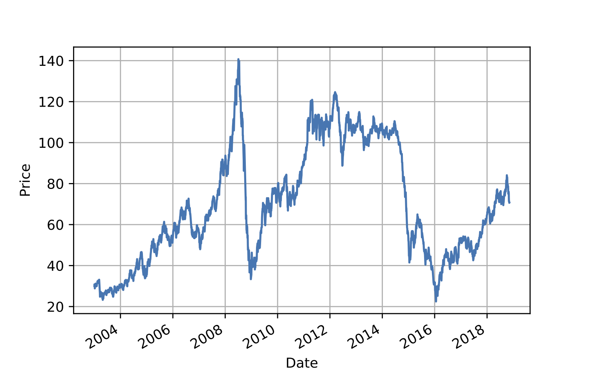
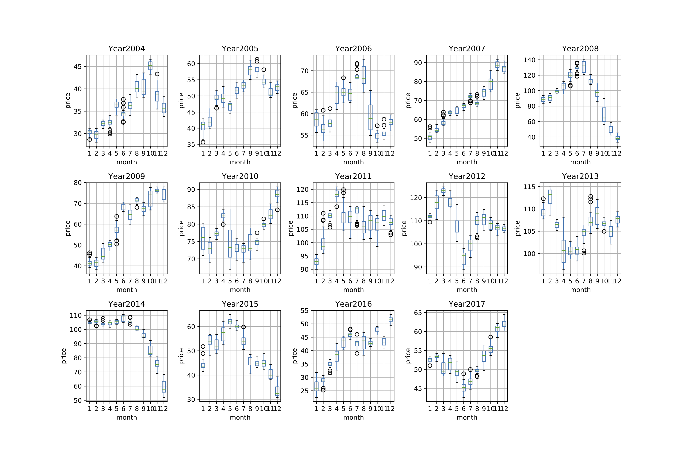
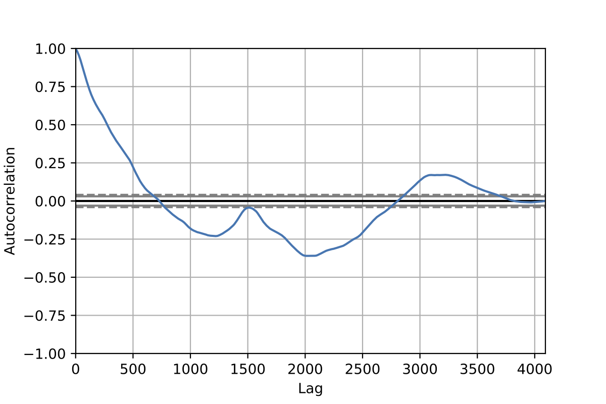
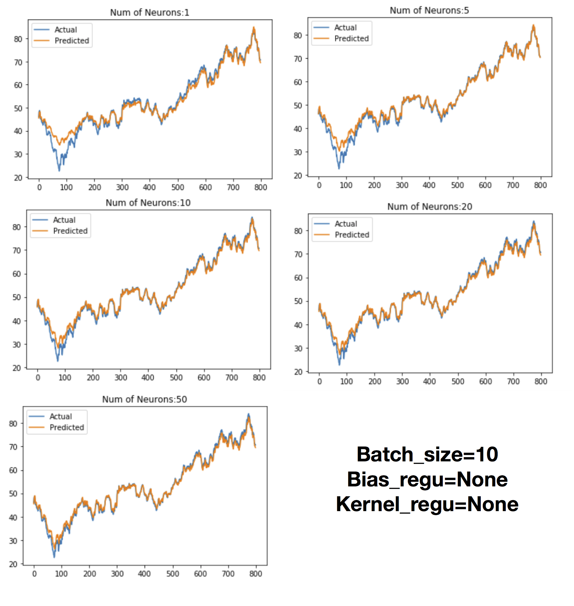
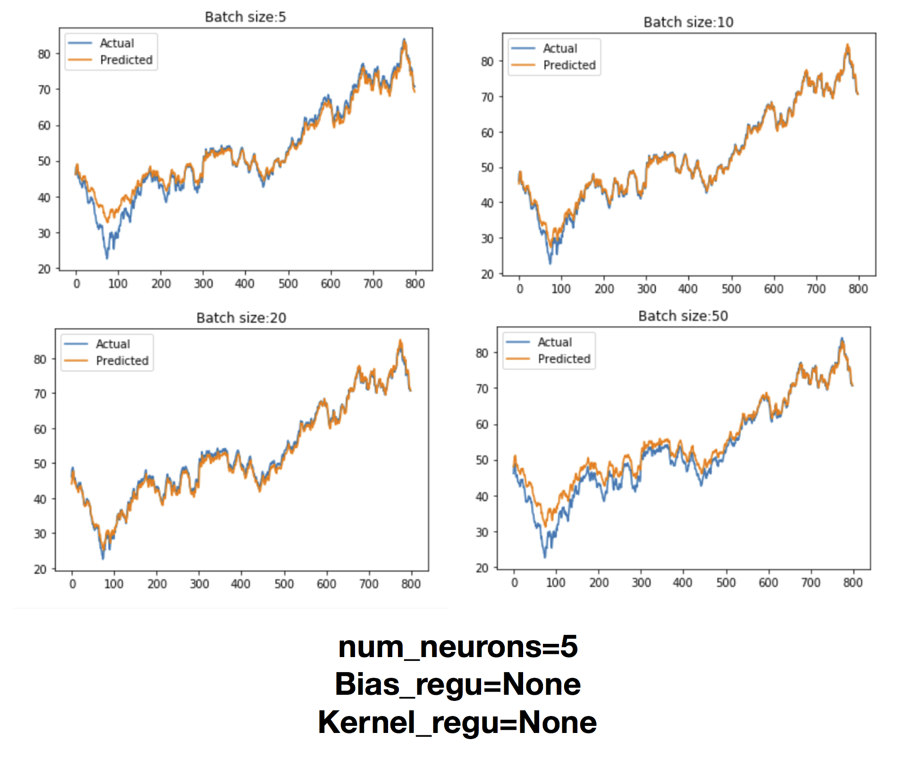
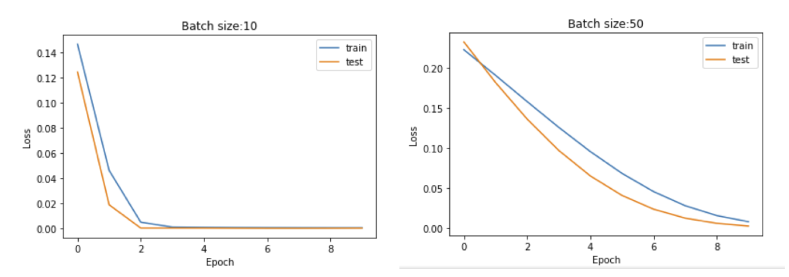
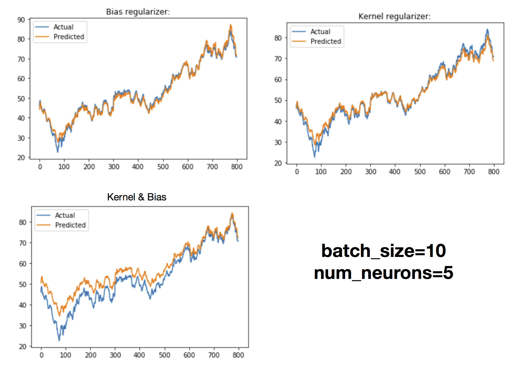
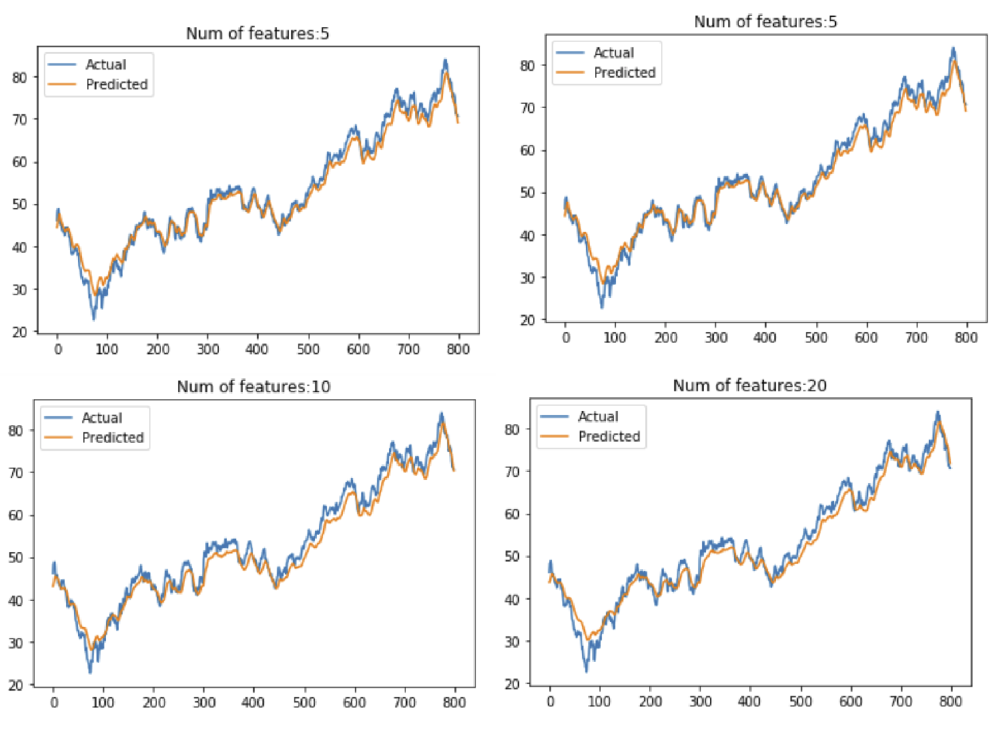
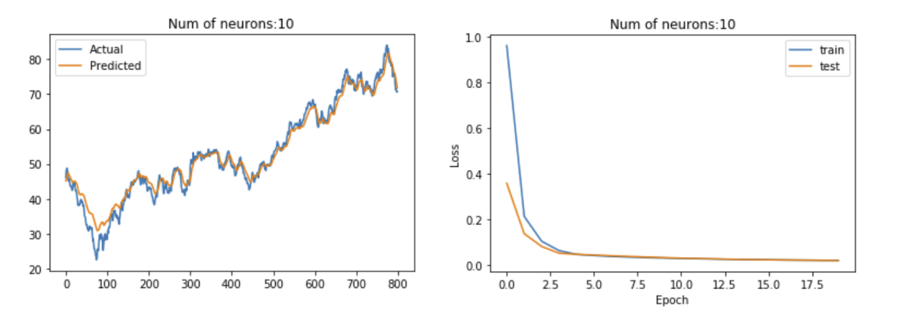

# Predict Friday's oil price
##  DataChallenge
### Natacha Altamirano

## DESCRIPTION 
(source [Invesopidia](https://www.investopedia.com/articles/economics/08/determining-oil-prices.asp#ixzz5Wu4aSckV ))

The Goal of this challenge is to predict the price of crude oil on Friday Nov 16th 2018. Crude oil is a high-demand commodity and its price as a huge impact in the economy worldwide. The price in in generally quoted as price per barrel and tends to be very volatile depending on two major factors:

- Supply and Demand
- Market feeling

As demand increases (or supply decreases) the price should go up. As demand decreases (or supply increases) the price should go down. However, the price of crude oil is set in the futures market, where a future contract gives one the right to purchase oil by the barrel at a predefined price on a predefined date in the future. Under a futures contract, both the buyer and the seller are obligated to fulfill their side of the transaction on the specified date. Some of the entities trading these contracts are speculators and probably whose are the once in charge of the high volatility of oil price.

On the market side, the  biggest influencer of oil prices is OPEC, made up of 13 countries (Algeria, Angola, Ecuador, Indonesia, Iran, Iraq, Kuwait, Libya, Nigeria, Qatar, Saudi Arabia, the United Arab Emirates and Venezuela); collectively, OPEC controls 40% of the world's supply of oil.

## DATA

A forecasting of oil price its not an easy task for three reasons

- High volatility
- No seasonality
- Controlling commodity (The price of the oil has a bigger impact in other commodity prices and not vice versa)

We can try to model both the market feeling and the supply demand, for example

- **S/D** get time series data of energy consumption for US (as a proxy of world energy consumption), get oil reserves data for US, use future contracts past data to estimate the price of future contracts for the future. 

- **Market** get data of oil reserves for OPEC countries

However, given the time-contraint we are going to focus as a first step to build a predicting mode given just data of past crude oil price. For this we retrieve data from [OPEC](https://www.investopedia.com/terms/o/opec.asp) basket crude oil price on [QUNADL](https://www.quandl.com/data/OPEC/ORB-OPEC-Crude-Oil-Price). This is a weighted average of the crude oil barrel price for the different countries in OPEC. We could have consider other data sets like the [WTI](https://www.investopedia.com/terms/w/wti.asp) or [Brent](https://www.investopedia.com/terms/b/brentblend.asp) but we are considering OPEC since they own 40%. However an interesting direction is combining this threee data sets. 

### Data exploration

[NOTEBOOK](https://github.com/natachaaltamirano/Oil_price_forecasting_using_LSTM/blob/master/1_Data_Exploration.ipynb)

The OPEC data looks like (we have data up to Nov. 8 2018 6 days before the wanted values)

Exploring the seasonality we realize there is no clear pattern that could indicate a monthly seasonality in the oil price. 

This could tell us that there is not clear correlation between energy demand (high in winter) and the price of OPEC crude oil, or, if it is, it is hidden behind some bigger effects.

#### Correlation an autocorrelation

Lets now measure the autocorrelation of our time series. This information will tell us how correlated is an event at time t with the event at time t-1. In the following we show the correlation plot at time t and several lag steps

We can explore this autocorrelation function as function of the lag

We see that the autocorrelation is negative after about 2 years. However, there is no clear patter of seasonality either here.

## MODEL

Eventhough there are *classical* models available in this challenge we are going to make use of a LSTM (Long-Short Term Memory). An LSTM is a Recursive Neural Network (RNN) modify in such a way that is allowed to forget what it learnt after some period of time. This makes an LSTM faster to run and also numerically stable. 
An RNN is esentially a neural network that is allowed to learn from the past:

This network will allow us to learn information about different frequencies of our time series as opposed to classical model where ones learns more easily the large scale behaviour. Our implementation its done in Keras.

### Vanilla model

[NOTEBOOK](https://github.com/natachaaltamirano/Oil_price_forecasting_using_LSTM/blob/master/2_LSTM_vanilla.ipynb)

In this first step we are using an LSTM with 1 feature (lag 1). We are trying with different amount of hidden neurones fixing the batch size and the regularization

We find that our model is highly overfitting, even with the small amount of neurones. It overfits two things

- Large scale (short frequencies) this is the long modulation of the data
- Short scale (high frequency) fine tuning detail

In what follows we will start tuning hyperparameters to try to avoid overfitting. We divide it in two step

- Large scale (short frequencies): change the regularization procedure and batch size
- Short scale (high frequency): change the number of features (add lags) to the model

[NOTEBOOK](https://github.com/natachaaltamirano/Oil_price_forecasting_using_LSTM/blob/master/3_LSTM_vanilla_hyper_search.ipynb)

We could try doing a grid search of this hyperparameters, however a very simple grid search will involve comparing thousands of LSTM models and its simple computationally very expensive. That is why we have decided changing hyperparameters and comparing to our vanilla model. **This is something that should be included in the next step for the model**

### Changing Batch size

          
We see that small and large enough batch sizes help with overfitting. However the model with batch size of 50 takes more epochs to converge and thus is less efficient than a model with less batches. 

For this reason we pick a batch size of 10. 

### Regularizing the model

There are different regularization methods for neural networks. In this case we try the bias regularization and kernel regularization and compare how this affect our vanilla model

We find that

- Bias regularization in general shifts the model up
- Kernel regularization changes the extreme of the tails up/down
- The overall effect is to extremely shift up the prediction

**Using this 1-feature model with the best hyperparameter we predict that Friday's oil price is 78 dollars. **

### Changing the number of features

[NOTEBOOK1](https://github.com/natachaaltamirano/Oil_price_forecasting_using_LSTM/blob/master/4_LSTM_added_features.ipynb)

[NOTEBOOK2](https://github.com/natachaaltamirano/Oil_price_forecasting_using_LSTM/blob/master/5_LSTM_added_features_and_hyper_search.ipynb)

Previously we have addressed the large scale overfitting with different hyperparamenters and regularization methods. But we have also mention that we have a short scale overfitting. To address this we are going to add features to our model.

We do this by using a series of lagged events. We show below the performance of our model for different number of features 

We notice that the more features we have the more short scale structure we lose. This is indeed good since we don't want our model to overfit in this scales either. WE have chosen to work with a number of 20 features. However, now that some of the short scale structure is washed out we need to find again the number of neurones that make our model *optimal*. Doing a similar analysis we decide to work with 10 neurones. 

The final model we use has:

- num_neurons=10
- batch_size=10
- num_features=20
- epochs=10
- bias and kernel regularization

**Using this model the predicted oil price is 75.27 USD**

## Improvements and future directions

- Explore in grid the hyperparameters
- Aggregate other data sets to our data sets: other commodity prices, oil reserves, future contracts prices, energy consumption, maybe some news NLP (?)
- how can I bagged classical and deep models?
- There ought to be a frequency analysis of this time series data that might be fun to try

